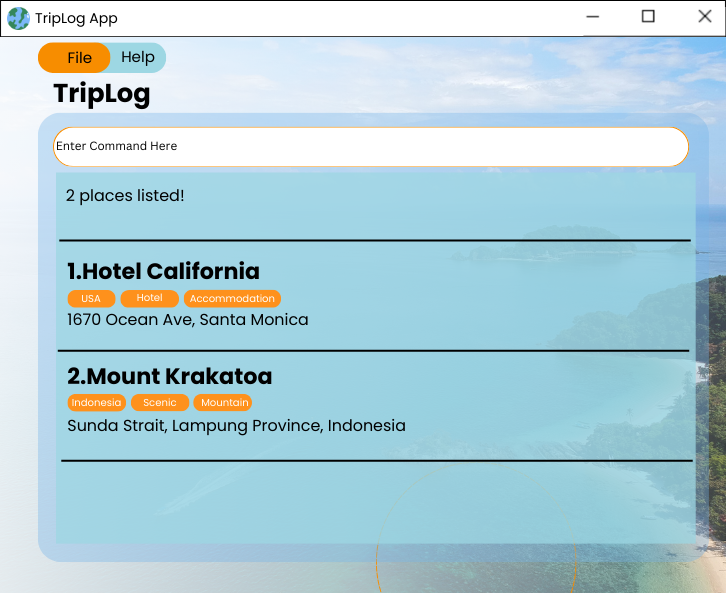

# TripLog

[](https://github.com/AY2526S2-CS2103-F13-2/tp/actions)
[](https://codecov.io/gh/AY2526S2-CS2103-F13-2/tp)



**TripLog** is a CLI-centric desktop application designed for travelers who prefer a streamlined, keyboard-first workflow for managing itineraries.

## Key Features
* **Fast and Distraction-Free:** Designed for power users like software developers who want to log destinations and activities without leaving their terminal.
* **Temporal Dashboard:** Automatically categorizes trips into *Upcoming*, *Ongoing*, *Completed*, and *Planning* states for an instant itinerary overview.
* **Multi-Key Sorting:** Organize logs by destination name, start/end dates, or trip duration with stable tie-breaking logic.
* **Privacy Focused:** Keeps your travel history stored locally, ensuring your data is private and accessible offline.
* **Precision Planning:** Built-in checks to prevent accidental double-booking of flights or overlapping schedules.

---

## Quick Start

### Setup
1. Ensure you have **Java 17** or above installed.
2. Download the latest `.jar` from [Releases](https://github.com/AY2526S2-CS2103-F13-2/tp/releases).
3. Run the application via terminal:
   ```bash
   java -jar triplog.jar
4. Type `help` in the command box to see available commands.

---

## Documentation
* [User Guide](docs/UserGuide.md)
* [Developer Guide](docs/DeveloperGuide.md)
* [About Us](docs/AboutUs.md)

---

## Acknowledgments
Built as part of the CS2103T Software Engineering module at the National University of Singapore, based on the [AddressBook-Level3](https://github.com/se-edu/addressbook-level3) project by the [SE-EDU initiative](https://se-education.org).
